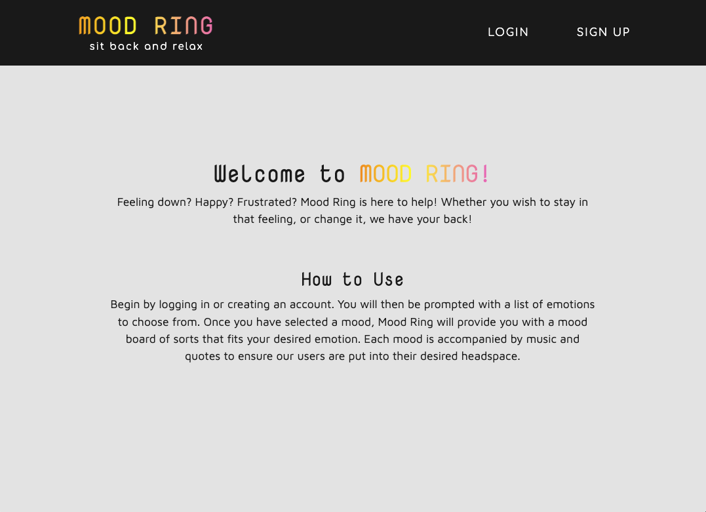
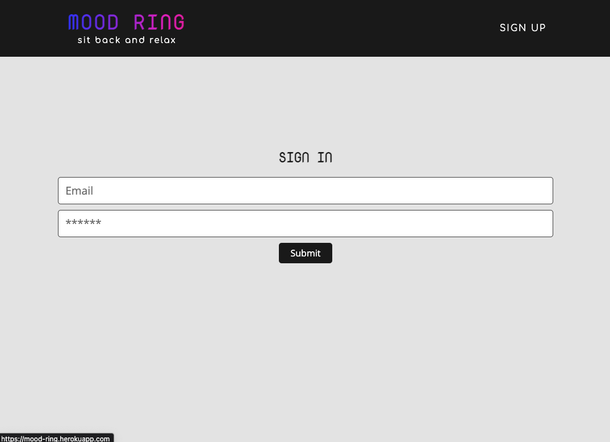
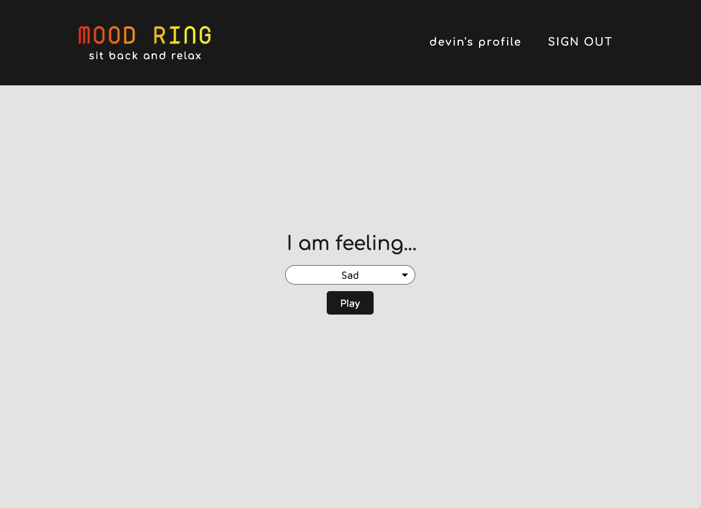
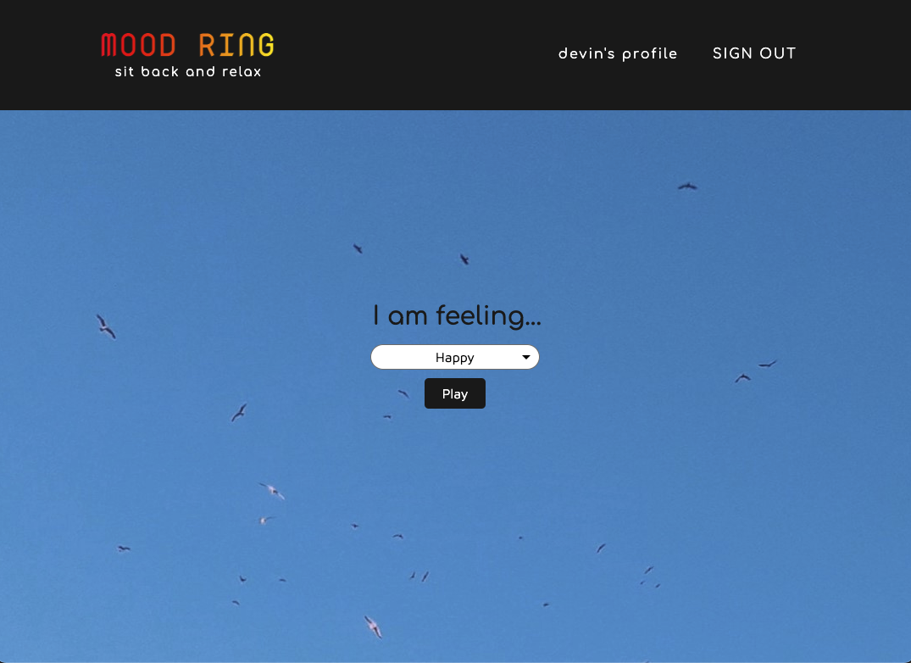
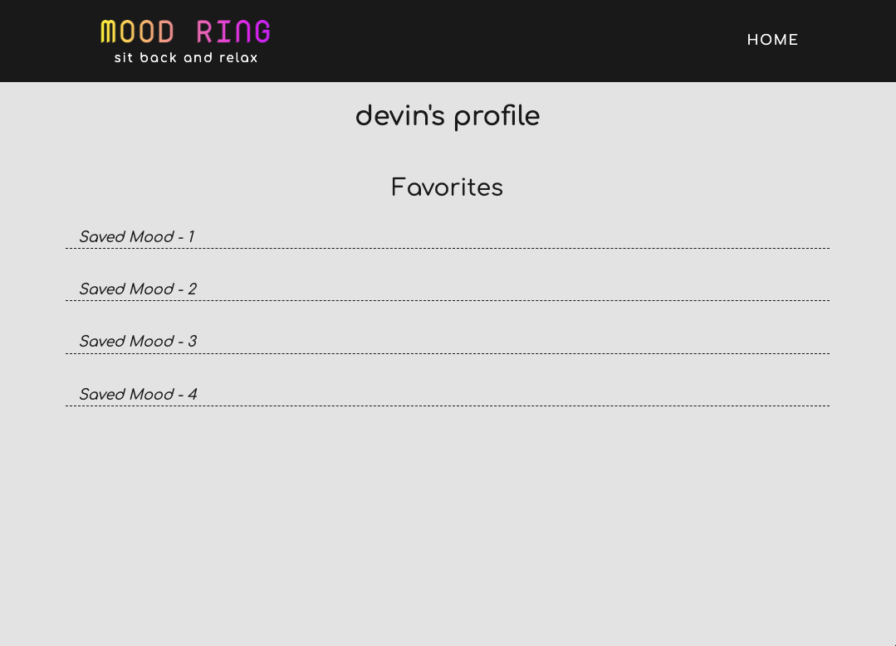

# mood-ring

# Description 
Feeling down? Happy? Frustrated? Mood Ring is here to help! Whether you wish to stay in that feeling, or change it, we have your back. Log in, choose your desired mood and our app will create a mood board that fits your desired emotion.


# User Story 
```
WHEN a USER opens the website
THEN a guide will be displayed as well as the option to Log in or Sign up.
WHEN USER logs in or signs up
THEN a dropdown menu of moods/emoji appears.
WHEN a USER chooses a mood/emoji
THEN the background color of the website changes to reflect the mood. Music is played 
depending on the mood that was chosen.
```

# Walkthrough 
https://drive.google.com/file/d/1sOp-sCibZThiLIR6pCMUNBtn1ouvii38/view
https://drive.google.com/file/d/1Onbwkg7Tipu2uTOluzJbldoA4U6Jna5f/view
https://drive.google.com/file/d/1FmVzG7dfOkncf9Bubjc78EhMU3lhPuy-/view
https://drive.google.com/file/d/1z7OY4A-ipsZtAxQLdwrsIdErzFMU1VH3/view

# Screenshots 
homepage

signup/login

mood select (before)

mood select (after)

profile


# Technologies Used 
* CSS
* Bootstrap
* REACT
* Javascript
* Node.js 
* Express.js 
* Jukebox API
* use-sound
* web-vitals
* Heroku

# Future Development 
* Give users an option to choose desired mood ("I'm sad, but want to be happy")
* Allow users to share music to social media
* Allow users to favorite their moods
* Allow users to save past moods


# Links
* <a href="https://mood-ring.herokuapp.com/" target="_blank">Heroku App</a>
* <a href="https://github.com/kthomasnj/mood-ring" target="_blank">Github</a>
